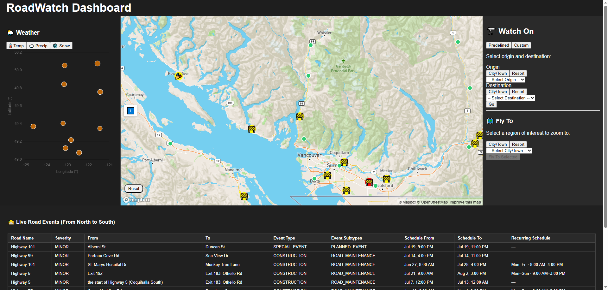

# 🛣️ Roadwatch

**Roadwatch** is a real-time dashboard for monitoring road conditions, weather hazards, and travel routes across British Columbia. Designed especially for travel between cities, mountain passes, and ski resorts, it integrates live event data and weather forecasts to help users make safer travel decisions.

---

## 🌐 Live Features

- 🗺️ **Interactive Map** (built with Mapbox GL JS)
- 🚧 **Live Event Data** [Open511-DriveBC APIs](https://api.open511.gov.bc.ca/help) 
- 🌦️ **Current Weather Conditions** from [Open-Meteo](https://open-meteo.com/)
- 📍 **Station-level Details** with temperature, precipitation, snowfall, wind, etc.
- 🧭 **Custom Route & Corridor Selection**
- 🔍 **BBOX-based filtering** for dynamic data loading

---

## 🛠️ Tech Stack

### Frontend:
- React
- Mapbox GL JS
- Chart.js (for weather visualization)

### Backend:
- Flask (Python)
- Open-Meteo API (weather)
- DriveBC Open511 (events)
- Custom GeoJSON station loader
- Auto-refresh weather cache

---

## 🚀 Getting Started

### 1. Clone the repo
```bash
git clone https://github.com/your-username/roadwatch.git
cd roadwatch
```

### 2. Setup the backend
```bash
cd backend
pip install -r requirements.txt
python app.py
```

### 3. Run the frontend
```bash
cd frontend
npm install
npm start
```

---

## 🗂️ Project Structure

```
roadwatch/
├── backend/
│   ├── app.py
│   ├── data_cache.py
│   ├── fetch_data.py
│   └── static_data/
│       └── weather_station_core.geojson
├── frontend/
│   ├── public/
│   ├── src/
│   │   ├── components/
│   │   ├── panel_weather/
│   │   └── App.js
│   └── package.json
```

---

## 📦 API Endpoints

| Endpoint | Description |
|----------|-------------|
| `/stations?bbox=...` | Returns enriched weather station data |
| `/events?bbox=...` | Returns live event data (construction, incidents, etc.) |
| `/api/weather` | Fetch single-point Open-Meteo weather |
| `/api/weather/batch` | (deprecated) Batch weather enrichment (frontend-only) |

---

## 🧊 Caching

- Weather is cached in memory per lat/lon for 1 hour.
- Station enrichment occurs on the backend (GeoJSON + weather = enriched station object).

---

## 📸 Screenshots




---

## 🙋‍♀️ Maintainer

**Wade Zhang**  
M.Sc.E. in Geomatics Engineering | Geospatial Data Science | GIS | Agent-Based Modelling (ABM)

---

## 📄 License

MIT License